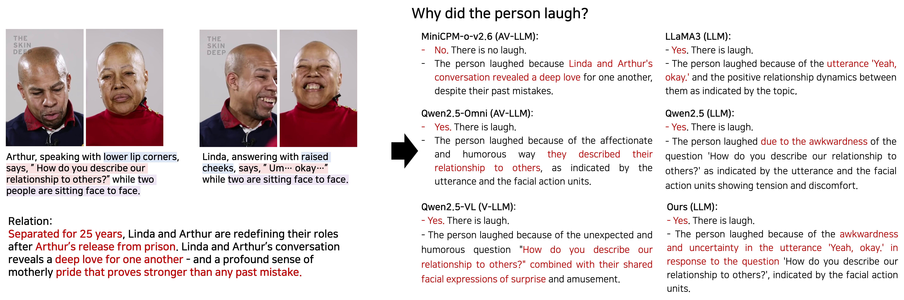

# SMILE-Next: Teaching Large Language Models to Detect, Classify, and Reason about Laughter
<h3>ACL 2026 Oral</h3>

### [Project Page](https://mok0102.github.io/smile-next/) | [Paper](https://aclanthology.org/2026.acl-long.2023/) | [Dataset](https://huggingface.co/datasets/mok0102/SMILE-Next)
This repository contains the official implementation of the SMILE-Next paper,

"😆 SMILE-Next: Teaching Large Language Models to Detect, Classify, and Reason about Laughter".

<!--  -->


## Highlights
**SMILE-Next enables comprehensive real-world laughter understanding beyond isolated recognition tasks.** 

🌟 We introduce **😆 SMILE-Next**, a large-scale benchmark with multimodal textual representations and QA annotations covering three fundamental laughter understanding tasks: `laughter detection`, `laughter type classification`, and `laughter reasoning`.

🧠 We present **Mixture-of-Laugh-Experts (MoLE)**, a task-adaptive expert routing framework that dynamically selects specialized experts for different laughter understanding tasks, achieving both higher accuracy and better efficiency.

🚀 Our approach, utilizing multimodal textual representation with Mixture-of-Laugh-Experts has outperformed multimodal audio-visual LLMs, visual LLMs, advancing robust and nuanced understanding of laughter in real-world social interactions.


## Getting started
This code was developed on Ubuntu 18.04 with Python 3.8, CUDA 12.1 and PyTorch 2.6.0, using NVIDIA RTX A100 (80GB) 4 GPU. 
Older or Later versions should work, but have not been tested.


### Environment setup

```bash
conda create -n smilenext python=3.11
conda activate smilenext

# set CUDA PATH
export CUDA_HOME=/usr/local/cuda-12.1
export PATH=$CUDA_HOME/bin:$PATH
export LD_LIBRARY_PATH=$CUDA_HOME/lib64:$LD_LIBRARY_PATH

# install required packages
pip install -r requirements.txt
```

### Installation of the customized packages
Especiallly, [LLamaFactory](https://github.com/hiyouga/LlamaFactory), [PEFT](https://github.com/huggingface/peft) packages are customized for Mixture-of-Laugh-Experts Training.

#### Customized LLamaFactory Installation
I have provided the customized LLamaFactory at here: https://github.com/mok0102/LlamaFactory.

For installating the customzied LLamaFactory, please follow below.
```bash
git clone --branch smilenext-version https://github.com/mok0102/LlamaFactory.git
git 
conda activate smilenext
pip install -e .
```

#### Customized PEFT Installation
The customized PEFT for MoLE is at: https://github.com/mok0102/peft

For installating the customzied PEFT, please follow below.
```bash
git clone --branch smilenext-version https://github.com/mok0102/peft.git
git 
conda activate smilenext
pip install -e .
```

### Preparing SMILE-Next dataset
We provide the SMILE-Next's textual multimodal instruction dataset for LLM training at `SMILE-Next/data`.


### Training with Mixture-of-Experts
Given a SMILE-Next dataset with self-instruction, you can simply 
```bash
# Qwen2.5-7B-MoLE
CUDA_VISIBLE_DEVICES=0,1,2,3 FORCE_TORCHRUN=1 llamafactory-cli train llamafactory_configs/qwen25_moelora_sft_ds3.yaml

# LLaMA3-7B-MoLE
CUDA_VISIBLE_DEVICES=0,1,2,3 llamafactory-cli train llamafactory_configs/qwen25_selfinst_moelora_sft_ds3.yaml
```

### Inference
You can conduct an inference by using below code.
```bash
# Caution: No LoRA merge is conducted for MoLE due to the gating

# LLaMA3-MoLE inference
CUDA_VISIBLE_DEVICES=0 python3 scripts/inference_llama3.py --adapter_name_or_path "./models/saves/llama3-8b/moelora/sft_selfinst" --save_name ./models/saves/qwen2.5-7b/moelora/sft_selfinst/generated_predictions.jsonl

# Qwen2.5-MoLE inference
CUDA_VISIBLE_DEVICES=0 python3 scripts/inference_llama3.py
--adapter_name_or_path "./models/saves/qwen2.5-7b/moelora/sft_selfinst" --save_name ./models/saves/qwen2.5-7b/moelora/sft_selfinst/generated_predictions.jsonl
```


## Citation
If you find our code or paper helps, please consider citing:
````BibTeX
@inproceedings{jung-mok-etal-2026-smile,
    title = "{SMILE}-Next: Teaching Large Language Models to Detect, Classify, and Reason about Laughter",
    author = "Jung-Mok, Lee  and Sung-Bin, Kim  and Chang, Joohyun  and Hyun, Lee  and Oh, Tae-Hyun",
    editor = "Liakata, Maria  and Moreira, Viviane P.  and Zhang Jiajun  and Jurgens, David",
    booktitle = "Proceedings of the 64th Annual Meeting of the {A}ssociation for {C}omputational {L}inguistics (Volume 1: Long Papers)",
    month = jul,
    year = "2026",
    address = "San Diego, California, United States",
    publisher = "Association for Computational Linguistics",
    url = "https://aclanthology.org/2026.acl-long.2023/",
    pages = "43675--43693",
    ISBN = "979-8-89176-390-6"
}
````


## Contact
Lee JungMok (jungmok.lee@kaist.ac.kr)


## Acknowledgement
The implementation of SMILE-Next is largely inspired and fine-tuned from the seminal projects.
We would like to express our sincere gratitude to the authors for making their code public.
- LLaMA-Factory (https://github.com/hiyouga/LlamaFactory)
- PEFT (https://github.com/huggingface/peft)

